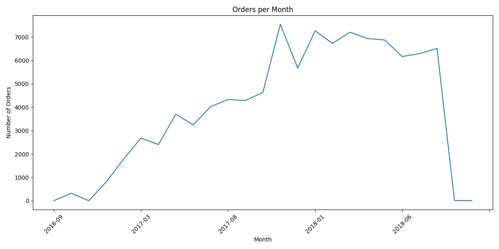
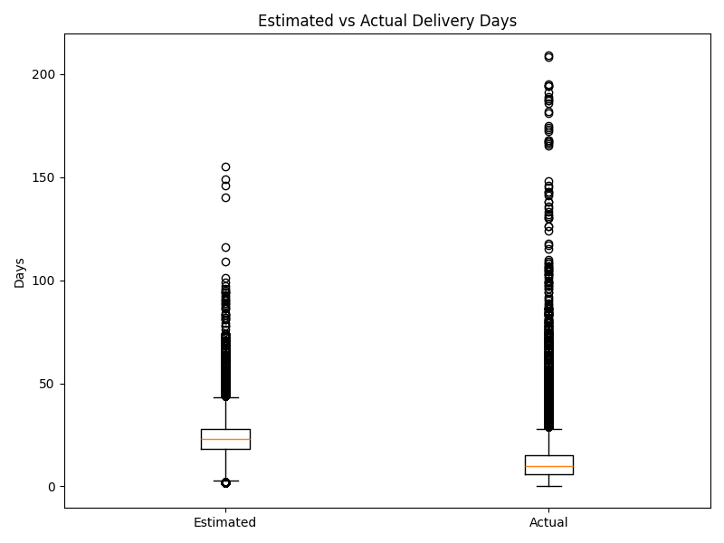
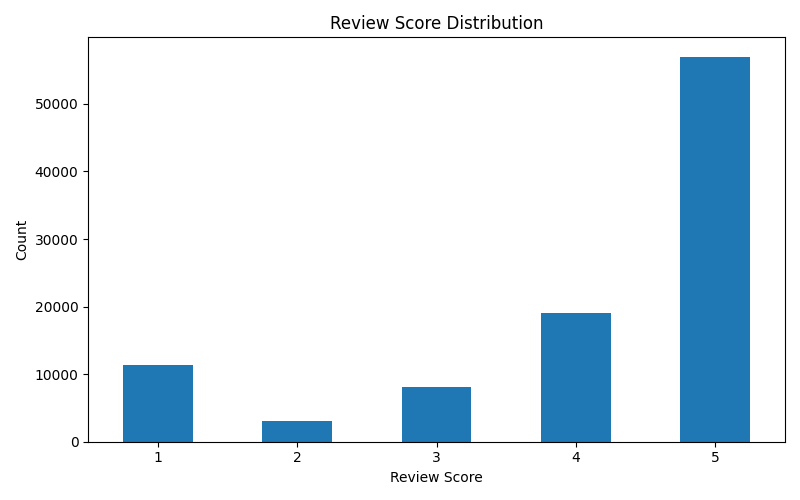

# 🛒 Olist Retail Intelligence Pipeline

## 📊 Project Overview
This project simulates a real-world data analyst role at Olist, Brazil’s largest e-commerce marketplace.

The goal is to transform raw transactional data into actionable business insights by building an end-to-end data pipeline using Python and MySQL.

Key focus areas:
- Delivery performance & delays
- Revenue and seller performance
- Customer behavior and lifetime value

---

## 🛠️ Tools Used
- Python (Pandas, SQLAlchemy, Matplotlib)
- MySQL (Data storage & analysis)
- VS Code (Development environment)
- Power BI *(coming next phase)*

---

## 🧹 Data Cleaning Steps
- Converted all timestamp columns to datetime format
- Removed invalid or negative price values
- Standardized ZIP code formatting (preserved leading zeros)
- Handled missing product categories
- Verified data consistency across all tables

---

## 🗄️ Database Schema
The data is structured using a relational model:

- `orders` → central table
- `order_items` → connects products & sellers
- `customers`
- `products`
- `sellers`
- `payments`
- `reviews`

This design allows for scalable business analysis across multiple dimensions.

---

## 🔍 Key Insights
- Certain states experience significantly higher delivery delays
- A small group of sellers dominate revenue within categories
- Credit card users have higher average order values
- High-value customers place multiple repeat orders

---

## 📈 Visualizations

### Orders Over Time

### Delivery Performance

### Review Score Distribution

---

## 💡 Business Recommendations
- Improve logistics in high-delay states
- Optimize shipping routes and fulfillment centers
- Focus marketing on high-value repeat customers
- Support mid-tier sellers to increase marketplace balance

---

## 🚀 Next Steps
- Build interactive dashboards in Power BI
- Automate reporting workflows
- Expand analysis to forecasting and demand trends

---

## 👩‍💻 Author
Jessica Dawson  
Aspiring Data Analyst | Business Intelligence | SQL | Python